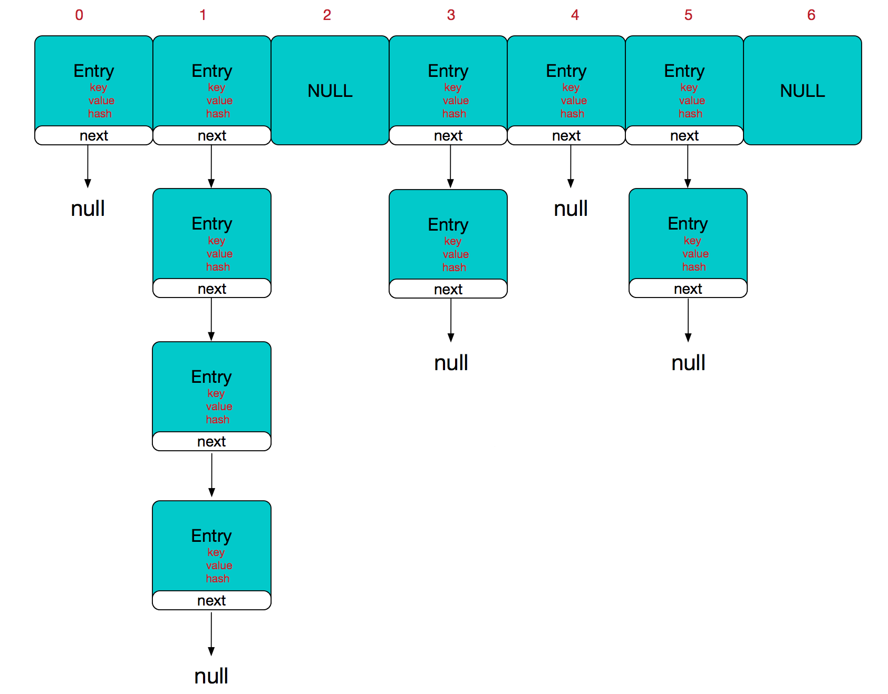

# HashMap的数据结构
**HashMap的数据结构 = 数组 + 链表**



如上图所示，横向表示数组（0、1、2、3、4、5、6是数组中的元素），竖向表示数组的元素（实际上是一个链表）。

数组中的每一个元素都是一个 Node<K,V>。

## Node结构
```java
static class Node<K,V> implements Map.Entry<K,V> {
        final int hash;
        final K key;
        V value;
        Node<K,V> next;
        
        // ...
}
```

## Node的存储形式
```java
transient Node<K,V>[] table;
```

## 初始化HashMap
```java
    public HashMap(int initialCapacity, float loadFactor) {
        if (initialCapacity < 0)
            throw new IllegalArgumentException("Illegal initial capacity: " +
                                               initialCapacity);
        if (initialCapacity > MAXIMUM_CAPACITY)
            initialCapacity = MAXIMUM_CAPACITY;
        if (loadFactor <= 0 || Float.isNaN(loadFactor))
            throw new IllegalArgumentException("Illegal load factor: " +
                                               loadFactor);
        this.loadFactor = loadFactor;
        this.threshold = tableSizeFor(initialCapacity);
    }
```

# put(key, value)
根据 key 的 hashCode 计算这个元素在数组中的位置（即下标），当不同的 key 产生相同的 hashCode 时，就会产生 hash 冲突：

- 如果该位置为空，就直接把元素以 Entry<K, V> 的形式存放在数组中

- 如果该位置不为空，就判断 key：
   - 如果 key 相同，就直接替换 value
   - 如果 key 不同，就形成一个单链表，将元素以 Entry<K, V> 的形式存放在链表中（新加入的元素放在链表的头部，最先加入的元素在表尾），这样就解决了 hash 冲突

## 计算元素在数组中的位置
通过 indexFor(hash, table.length) 计算每个元素在数组中的位置，源码：

```java
static int indexFor(int h, int length) {
   return h & (length-1);
}
```

## Hashmap的大小为什么是2的幂次

因为在计算元素存放位置的时候，用到的算法是 **h & (length-1)** ：

如果 map 长度为 2 的幂次，那么 length - 1 的二进制一定为 11111... 这种形式，进行与运算的结果完全取决于元素的hashCode；

如果 map 的长度不是 2 的幂次，比如为 15 ，那么 length - 1 就是 14，二进制为 1110，无论与谁相与最后一位一定是 0，这样就会造成 0001、0011、0101、1001、1011、0111、1101等位置永远都不会存放元素，空间浪费相当大。也增加了添加元素是发生碰撞的机会，减慢了查询效率。

# get(key)
首先计算 key 的 hashCode，找到数组中对应位置的元素，然后通过 key 的 equals 方法在对应位置的元素（链表）中找到需要的元素。

从这一点可以看出，如果每个位置上的链表都只有一个元素，那么 HashMap 的 get 效率将是最高的。所以我们需要将元素尽可能的平均地存放在数组中每个位置上。

# 扩容
```java
static final int DEFAULT_INITIAL_CAPACITY = 1 << 4; // HashMap初始容量大小(16) 
static final int MAXIMUM_CAPACITY = 1 << 30; // HashMap最大容量
static final float DEFAULT_LOAD_FACTOR = 0.75f; // 负载因子
transient Node<K,V>[] table;
```

所谓扩容，就是在 table 数组的容量达到阀值的时候，需要进行扩容。

```java
int threshold;
```

当元素的数量大于阈值（threshold）时就会触扩容发。

```java
threshold = loadFactor * capacity
```

比如 HashMap 中默认的 loadFactor = 0.75, capacity = 16：

```java
threshold = loadFactor * capacity = 0.75 * 16 = 12
```

那么在元素数量大于 12 时， table 就会进行扩容，扩容调用的是 resize() 方法。 扩容后的数组容量为 2 * 16 = 32，即扩大一倍，然后重新计算每个元素在数组中的位置。扩容需要进行数组复制，而复制数组是非常消耗性能的操作，所以如果我们已经预知 HashMap 中元素的个数，那么预设元素的个数能够有效的提高 HashMap 的性能。

```
HashMap 不是无限扩容的，当达到了实现预定的 MAXIMUM_CAPACITY，就不再进行扩容。
```

例如，数组容量为 16，现在有 3 个对象A、B、C，其的 hash 值分别是 4、20、36；

通过 indexFor(hash, table.length) 计算后，A、B、C 对应的数组位置分别为4、4、4; 说明这 3 个对象在数组的同一位置上，于是就形成了 Entry 链；

当数组容量的容量扩容为 16 * 2 的时候，就会重新计算对象在数组中的位置，此时 A、B、C 对应的数组位置分别为 4、20、4; 对象 B 已经被放到其他位置了；

```
负载因子的值是 0.75。

如果过小，比如 0.5，那么当存放的元素超过一半时就进行扩容，会造成资源的浪费；

如果过大，比如 1，那么当元素满的时候才进行扩容，会使 get、put 操作的碰撞几率增加。
```
