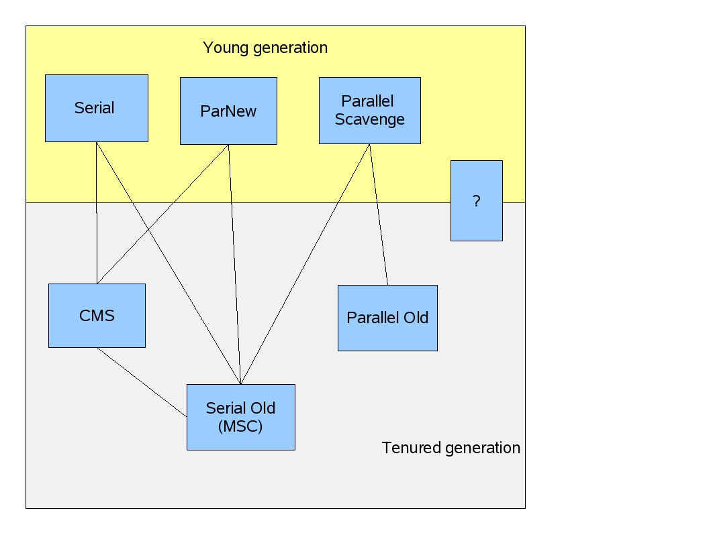
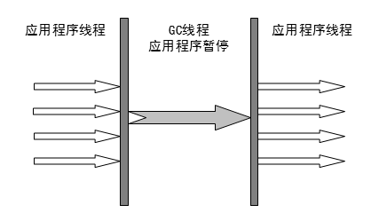
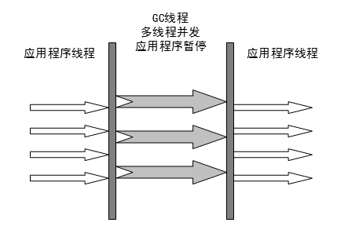
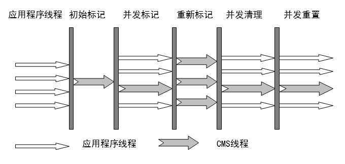

	本文所讨论的虚拟机为默认JDK所使用的HotSpot虚拟机。
# 1. Java堆内存结构
Java将堆内存分为3大部分：新生代、老年代和永久代，其中新生代又进一步划分为Eden、S0、S1(Survivor)三个区。结构如下图所示：
```
+---------------------------+-------------------------------+-------------------+
|          |       |        |                               |                   |
|   Eden   |   S0  |   S1   |       Old generation          |      Perm         |
|          |       |        |                               |                   |
+---------------------------+-------------------------------+-------------------+
|<----Young Gen Space------>|
```
我们在程序中new出来的对象一般情况下都会在新生代里的Eden区里面分配空间，如果存活时间足够长将会进入Survivor区，进而如果存活时间再长，还会被提升分配到老年代里面。持久代里面存放的是Class类元数据、方法描述等。
```
1. S0和S1是两个大小相等的区域，分配内存空间只会在其中某一个进行，另外一个空间是用来辅助进行新生代进行垃圾回收的，因为新生代的垃圾回收策略基于复制算法，其思想是将Eden区及两个Survivor中的某个区，如S0区里面需要存活的对象复制到另外一个空的Survivor区，如S1区，然后就可以回收Eden和S0区域里面的死亡对象。下一次回收就对调S0和S1两个区的角色，S1用来存放存活对象而S0用来辅助回收垃圾，如此循环利用。

2. 永久代就是我们所说的方法区，而方法区经常被称为Non-Heap(非堆)。仅仅在HotSpot虚拟机的实现中才将GC分代收集扩展至方法区，或者说使用永久代来实现方法区，对于其他的虚拟机是不存在永久代这个概念的。

3. 并非所有的对象创建都会在Eden区中分配内存空间。对于Serial和ParNew垃圾收集器,通过指定-XX:PretenureSizeThreshold={size}来设置超过这个阈值大小的对象直接进入老年代。
```

# 2. 分代回收算法
我们一般讨论的垃圾回收主要针对Java堆内存中的新生代和老年代，也正因为新生代和老年代结构上的不同，所以产生了分代回收算法，即新生代的垃圾回收和老年代的垃圾回收采用的是不同的回收算法。针对新生代，主要采用复制算法，而针对老年代，通常采用标记-清除算法或者标记-整理算法来进行回收。

## 2.1 复制算法
复制算法的思想是将内存分成大小相等的两块区域，每次使用其中的一块。当这一块的内存用完了，就将还存活的对象复制到另一块区域上，然后对该块进行内存回收。示例图如下所示：

这个算法实现简单，并且也相对高效，但是代价就是需要将牺牲一半的内存空间用于进行复制。有研究表明，新生代中的对象98%存活期很短，所以并不需要以1:1的比例来划分整个新生代，通常的做法是将新生代内存空间划分成一块较大的Eden区和两块较小的Survivor区，两块Survivor区域的大小保持一致。每次使用Eden和其中一块Survivor区，当回收的时候，将还存活的对象复制到另外一块Survivor空间上，最后清除Eden区和一开始使用的Survivor区。假如用于复制的Survivor区放不下存活的对象，那么会将对象存到老年代。
		HotSpot虚拟机默认Eden和Survivor的大小比例是8:1:1，也就是说新生代中牺牲掉10%的空间而不是一半的空间。

## 2.2 标记-清除算法
标记-清除(Mark-Sweep)算法分为两个阶段：
- 标记
- 清除

在标记阶段将标记出需要回收的对象空间，然后在下一个阶段清除阶段里面，将这些标记出来的对象空间回收掉。这种算法有两个主要问题：一个是标记和清除的效率不高，另一个问题是在清理之后会产生大量不连续的内存碎片，这样会导致在分配大对象时候无法找到足够的连续内存而触发另一次垃圾收集动作。标记-清除算法示例图如下所示：


## 2.3 标记-整理算法
标记-整理(Mark-Compact)算法有效预防了标记-清除算法中可能产生过多内存碎片的问题。在标记需要回收的对象以后，它会将所有存活的对象空间挪到一起，然后再执行清理。示例图如下所示：

```
标记-整理通常会在标记-清除算法里面作为备选方案，为了防止标记-清除后产生大量内存碎片而无法为大对象分配足够内存的情况，如后面所讲的Serial Old收集器(基于标记-整理算法实现)将会作为CMS收集器(基于标记-清除算法实现)的备选方案。
```

# 3. 垃圾收集器
因为新生代和老年代采用回收算法的不同，垃圾收集器相应地也分为新生代收集器和老年代收集器。其中新生代收集器主要有Serial收集器、ParNew收集器和Parallel Scavenge收集器。老年代收集器主要有Serial Old收集器、Parallel Old收集器和CMS收集器。当然还包括了一款全新的、新生代老年代通用的G1收集器。各款收集器的搭配使用如下图所示，其中有连线的代表收集器可以搭配使用，没有连线的收集器表示不能搭配使用。

		其中显示为?号的收集器叫做G1收集器，是目前最新的收集器。这篇文章不会涉及到它。

## 3.1 新生代收集器
### 3.1.1 Serial收集器
Serial收集器作用于新生代，是一个单线程收集器，基于复制算法实现。在进行垃圾回收的时候仅使用单条线程并且在回收的过程中会挂起所有的用户线程(Stop The World)。Serial收集器是JVM client模式下默认的新生代收集器。

		特别注意，Stop-The-World会挂起应用线程，造成应用的停顿。

### 3.1.2 ParNew收集器
ParNew收集器作用于新生代，是一个多线程收集器，基于复制算法实现。相对于Serial收集器而言，在垃圾回收的时候会同时使用多条线程进行回收，但是它跟Serial收集器一样，在回收过程中也是会挂起所有的用户线程，从而造成应用的停顿。


### 3.1.3 Parallel Scavenge收集器
Parallel Scavenge收集器同样作用于新生代，并且也是采用多线程和复制算法来进行垃圾回收。Parallel Scavenge收集器关注的是吞吐量，即使得应用能够充分使用CPU。它与ParNew收集器一样，在回收过程会挂起所有的用户线程，造成应用停顿。

    	所谓吞吐量就是CPU用于运行用户代码的时间与CPU总消耗时间的比值。即吞吐量 = 运行用户代码时间 / (运行用户代码时间 + 垃圾收集时间)。如果虚拟机运行了100分钟，其中垃圾收集花了1分钟，那么吞吐量就是99%。

## 3.2 老年代收集器
### 3.2.1 Serial Old收集器

Serial Old收集器作用于老年代，采用单线程和标记-整理算法来实现垃圾回收。在回收垃圾的时候同样会挂起所有用户线程，造成应用的停顿。一般来说，老年代的容量都比新生代要大，所以当发生老年代的垃圾回收时，STW经历的时间会比新生代所用的时间长得多。该收集器是JVM client模式下默认的老年代收集器。

    	Serial Old收集器还有一个重要的用途是作为CMS收集器的后备方案，在并发收集发生Concurrent Mode Failure的时候使用，进行内存碎片的整理。

### 3.2.2 Parallel Old收集器

Parallel Old收集器是Parallel Scavenge收集器的老年代版本，采用多线程和标记-整理算法来实现老年代的垃圾回收。这个收集器主要是为了配合Parallel Scavenge收集器的使用，即当新生代选择了Parallel Scavenge收集器的情况下，老年代可以选择Parallel Old收集器。

		在JDK1.6以前并没有提供Parallel Scavenge收集器，所以在1.6版本以前，Parallel Scavenge收集器只能与Serial Old收集器搭配使用。

### 3.2.3 CMS收集器

CMS(Concurrent Mark Sweep)收集器是一款真正实现了并发收集的老年代收集器。CMS收集器以获取最短回收停顿时间为目标，采用多线程并发以及标记-清除算法来实现垃圾回收。CMS只在初始化标记和重新标记阶段需要挂起用户线程,造成一定的应用停顿(STW)，而其他阶段收集线程都可以与用户线程并发交替进行，不必挂起用户线程，所以并不会造成应用的停顿。CMS收集器可以最大程度地减少因垃圾回收而造成应用停顿的时间。

CMS垃圾收集分为以下几个阶段：

1. 初始化标记 (inital mark)

这个阶段仅仅是标记了GC Roots能够直接关联到的对象，速度很快，所以基本上感受不到STW带来的停顿。

2. 并发标记 (concurrent mark)

并发标记阶段完成的任务是从第一阶段收集到的对象引用开始，遍历所有其他的对象引用，并标记所有需要回收的对象。这个阶段，收集线程与用户线程并发交替执行，不必挂起用户线程，所以并不会造成应用停顿。

3. 并发预清除 (concurrent-pre-clean)

并发预清除阶段是为了下一个阶段做准备，为的是尽量减少应用停顿的时间。

4. 重新标记 (remark)

这个阶段将会修正并发标记期间因为用户程序继续运作而导致标记产生变动的那部分对象的标记记录(有可能对象重新被引用或者新对象可以被回收)。这个阶段的停顿时间比初始标记阶段要长一些，但是远比并发标记的时间短。

5. 并发清除 (concurrent sweep)

这个阶段将真正执行垃圾回收，将那些不被使用的对象内存回收掉。

6. 并发重置 (concurrent reset)

收集器做一些收尾的工作，以便下一次GC周期能有一个干净的状态。

使用CMS要注意以下两个关键词：

- concurrent mode failure
- promotion failed

对于采用CMS进行老年代GC的程序而言，尤其要注意GC日志中是否有promotion failed和concurrent mode failure两种状况，当这两种状况出现时可能会触发Full GC。promotion failed是在进行Minor GC时，新生代的survivor区放不下,对象只能放入老年代，而此时老年代也放不下造成的。concurrent mode failure是在执行CMS GC的过程中同时有对象要放入老年代(满足一定年龄的对象或者大对象)，而此时老年代空间不足造成的。

		通常我们把发生在新生代的垃圾回收称为Minor GC，而把发生在老年代的垃圾回收称为Major GC，而FullGC是指整个堆内存的垃圾回收，包括对新生代、老年代和持久代的回收。一般情况下应用程序发生Minor GC的次数要远远大于Major GC和Full GC的次数。

		在讲解GC的时候会涉及到并行和并发两个概念。在这里，并行指的是多个GC收集线程之间并行进行垃圾回收。而并发指的是多个GC收集线程与所有的用户线程能够交替执行。

# 4. GC日志
了解GC日志可以帮助我们更好地排查一些线上问题，如OOM、应用停顿时间过长等等。GC日志对我们进行JVM调优也是很有帮助的。采用不同的GC收集器所产生的GC日志的格式会稍微不同，但虚拟机设计者为了方便用户阅读，将各个收集器的日志都维持一定的共性。

具有一定共性的的GC日志格式大致如下所示：
```
<datestamp>:[GC[<collector>:<start occupancy1>-><end occupancy1>(total size1),<pause time1> secs]<start occupancy2>-><end occupancy2>(total size2),<pause time2> secs] [Times:<user time> <system time>, <real time>]
```
- datestamp ： 表示GC日志产生的时间点，如果指定的jvm参数是-XX:+PrintGCTimeStamps,那么输出的是相对于虚拟机启动时间的时间戳，如果指定的是-XX:+PrintGCDateStamps，那么输出的是具体的时间格式，可读性更高

- GC ： 表示发生GC的类型，有GC(代表MinorGC)和FullGC两种情况

- collector ： 表示GC收集器类型，取值可能是DefNew、ParNew、PSYoungGen、Tenured、ParOldGen、PSPermGen等等

- start occupancy1 ： 表示发生回收之前占用的内存空间

- end occupancy1 ： 表示发生回收以后还占用的内存空间

- total size1 ： 该堆区域所拥有的总内存空间

- pause time1 ： 发生垃圾收集的时间

- start occupancy2 ： 表示回收前Java堆内存总占用空间

- end occupancy2 ： 表示回收后Java堆内存还占用的总空间

- total size2 ： 表示Java堆内存总空间

- pause time2 ： 表示整个堆回收消耗时间

## 4.1 Serial + Serial Old
```
-XX:+UseSerialGC
-Xms64m -Xmx64m
-Xmn32m
-XX:SurvivorRatio=8
-XX:+PrintGCDetails -XX:+PrintGCDateStamps

[GC log]
2016-04-22T15:00:00.647+0800: [GC2016-04-22T15:00:00.648+0800: [DefNew: 26152K->2513K(29504K), 0.0131820 secs] 26152K->25042K(62272K), 0.0132320 secs] [Times: user=0.00 sys=0.00, real=0.01 secs]
2016-04-22T15:00:00.663+0800: [GC2016-04-22T15:00:00.663+0800: [DefNew: 28155K->28155K(29504K), 0.0000125 secs]2016-04-22T15:00:00.663+0800: [Tenured: 22528K->31745K(32768K), 0.0114797 secs] 50684K->49617K(62272K), [Perm : 2753K->2753K(21248K)], 0.0115361 secs] [Times: user=0.00 sys=0.00, real=0.01 secs]
2016-04-22T15:00:01.676+0800: [Full GC2016-04-22T15:00:01.676+0800: [Tenured: 31745K->463K(32768K), 0.0039332 secs] 56964K->463K(62272K), [Perm : 2753K->2753K(21248K)], 0.0039788 secs] [Times: user=0.00 sys=0.00, real=0.00 secs]
```
GC日志第一行发生的是Minor GC。最开始的2016-04-22T15:00:00.647+0800表示发生GC的时间；DefNew表示新生代采用的是Serial收集器。26152K->2513K(29504K), 0.0131820 secs表示回收前新生代内存占用是26152K(约26M)，回收后内存占用是2513K(约2.5M)，括号里面的数字表示新生代的可用总容量为29504K(约29M)，一般来说这个数字约等于Eden区加上一个Survivor区的容量大小。最后的0.0131820 secs代表Minor GC消耗的时间。

GC日志第二行，新生代已经容纳不下新生的对象，需要把存活的对象不断的挪到老年，Tenured表示老年代采用的是Serial Old收集器。[Tenured: 22528K->31745K(32768K), 0.0114797 secs]表明老年代的容量不断被占用，并且已经接近满了，如果这个时候还不断有新对象生成并存活，那么将会发生OOM异常。

GC日志第三行发生的FullGC是由于程序调用了System.gc()造成的，这个时候keepInMemory()函数退出，局部变量将可以被回收，所以调用gc方法可以尽快通知虚拟机进行垃圾回收，所以我们可以看到堆内存的占用情况很快地降了下来。

```
	特别注意，如果把System.gc()方法写在keepInMemory()方法的最后，那么堆内存将不会被回收，因为方法没有退出，局部引用对象将一直存在于内存。
```

## 4.2 Parallel Scavenge + Parallel Old
```
-XX:+UseParallelGC -XX:+UseParallelOldGC
-Xms64m -Xmx64m
-Xmn32m
-XX:SurvivorRatio=8
-XX:+PrintGCDetails -XX:+PrintGCDateStamps

[GC log]
2016-04-22T14:09:28.990+0800: [GC [PSYoungGen: 26174K->2688K(29696K)] 26174K->25216K(62464K), 0.0090217 secs] [Times: user=0.00 sys=0.00, real=0.01 secs]
2016-04-22T14:09:28.999+0800: [Full GC [PSYoungGen: 2688K->0K(29696K)] [ParOldGen: 22528K->25040K(32768K)] 25216K->25040K(62464K) [PSPermGen: 2748K->2747K(21504K)], 0.0084858 secs] [Times: user=0.01 sys=0.00, real=0.01 secs]
2016-04-22T14:09:29.011+0800: [Full GC [PSYoungGen: 25657K->17408K(29696K)] [ParOldGen: 25040K->32208K(32768K)] 50698K->49616K(62464K) [PSPermGen: 2750K->2750K(21504K)], 0.0100313 secs] [Times: user=0.06 sys=0.00, real=0.01 secs]
2016-04-22T14:09:29.022+0800: [Full GC [PSYoungGen: 24758K->0K(29696K)] [ParOldGen: 32208K->462K(32768K)] 56966K->462K(62464K) [PSPermGen: 2750K->2750K(21504K)], 0.0057976 secs] [Times: user=0.00 sys=0.00, real=0.01 secs]
```
GC日志第一行发生的是Minor GC。最开始的2016-04-22T14:09:28.990+0800表示发生GC的时间；PSYoungGen表示新生代采用的是Parallel Scavenge收集器，后面的26174K->2688K(29696K)表示新生代回收前使用了26174K(约26M)的空间而回收后还占用了2688K(约2.6M)的空间，括号里面的数值表示新生代的可用总容量为29696K(约29M)，而后面的0.0090217 secs表示此次Minor GC耗费的时间。

GC日志第二行发生的是Full GC。其中包括了新生代、老年代和持久代的垃圾回收。从数据可以看出，在老年代发生GC以后占有的内存比回收前还要多[ParOldGen: 22528K->25040K(32768K)],证明此时程序应该有大量的对象存活并且由于新生代已经存放不下去了，只能由老年代来存放。持久代的垃圾回收内存占用基本保持不变。

GC日志第三行发生的Full GC是因为程序在结束的时候调用了System.gc()。所以堆内存的占用情况降了下来。

## 4.3 ParNew + CMS
```
-XX:+UseParNewGC -XX:+UseConcMarkSweepGC
-Xms64m -Xmx64m
-Xmn32m
-XX:SurvivorRatio=8
-XX:+PrintGCDetails -XX:+PrintGCDateStamps

[GC log]
2016-04-22T14:34:06.134+0800: [GC2016-04-22T14:34:06.134+0800: [ParNew: 26152K->2532K(29504K), 0.0076385 secs] 26152K->25069K(62272K), 0.0076904 secs] [Times: user=0.00 sys=0.00, real=0.01 secs]
2016-04-22T14:34:06.144+0800: [GC2016-04-22T14:34:06.145+0800: [ParNew: 28174K->28174K(29504K), 0.0000311 secs]2016-04-22T14:34:06.145+0800: [CMS: 22536K->31745K(32768K), 0.0170668 secs] 50711K->49617K(62272K), [CMS Perm : 2754K->2753K(21248K)], 0.0171470 secs] [Times: user=0.01 sys=0.00, real=0.02 secs]
2016-04-22T14:34:06.162+0800: [GC [1 CMS-initial-mark: 31745K(32768K)] 50641K(62272K), 0.0002688 secs] [Times: user=0.00 sys=0.00, real=0.00 secs]
2016-04-22T14:34:06.164+0800: [CMS-concurrent-mark: 0.002/0.002 secs] [Times: user=0.00 sys=0.00, real=0.00 secs]
2016-04-22T14:34:06.165+0800: [CMS-concurrent-preclean: 0.001/0.001 secs] [Times: user=0.00 sys=0.00, real=0.00 secs]
2016-04-22T14:34:06.165+0800: [CMS-concurrent-abortable-preclean: 0.000/0.000 secs] [Times: user=0.00 sys=0.00, real=0.00 secs]
2016-04-22T14:34:06.165+0800: [GC[YG occupancy: 25219 K (29504 K)]2016-04-22T14:34:06.165+0800: [Rescan (parallel) , 0.0002540 secs]2016-04-22T14:34:06.165+0800: [weak refs processing, 0.0000090 secs]2016-04-22T14:34:06.165+0800: [scrub string table, 0.0001010 secs] [1 CMS-remark: 31745K(32768K)] 56965K(62272K), 0.0004079 secs] [Times: user=0.00 sys=0.00, real=0.00 secs]
2016-04-22T14:34:06.165+0800: [CMS-concurrent-sweep: 0.000/0.000 secs] [Times: user=0.00 sys=0.00, real=0.00 secs]
2016-04-22T14:34:06.166+0800: [CMS-concurrent-reset: 0.000/0.000 secs] [Times: user=0.00 sys=0.00, real=0.00 secs]
2016-04-22T14:34:07.163+0800: [Full GC2016-04-22T14:34:07.163+0800: [CMS: 31745K->465K(32768K), 0.0066109 secs] 56965K->465K(62272K), [CMS Perm : 2753K->2753K(21248K)], 0.0066795 secs] [Times: user=0.00 sys=0.00, real=0.01 secs]
```
GC日志第一行，ParNew表示使用的新生代收集器为Parallel收集器。从第二行可以看出这个时候新生代已经容纳不下新对象了，对象往老年代放，造成老年代的容量不断增加。
[CMS: 22536K->31745K(32768K), 0.0170668 secs] 50711K->49617K(62272K),表示老年代使用的是CMS收集器。并且回收后的容量比回收前的容量还要高。

		注意这里的回收是由新生代引起的。

而后显示的是老年代CMS收集器发生GC的日志，从日志中可以看出CMS收集的所有阶段。
# 5. JVM参数使用
## 5.1 堆内存相关

- -Xms 与 -Xmx

-Xms用于指定Java应用使用的最小堆内存，如-Xms1024m表示将Java应用最小堆设置为1024M。-Xmx用于指定Java应用使用的最大堆内存，如-Xmx1024m表示将Java应用最大堆设置为1024m。过小的堆内存可能会造成程序抛出OOM异常，所以正常发布的应用应该明确指定这两个参数。并且，一般会选择将-Xms与-Xmx设置成一样大小，防止JVM动态调整堆内存容量对程序造成性能影响。

- -Xmn

通过-Xmn可以设置堆内存中新生代的容量，以此达到间接控制老年代容量的作用，因为没有JVM参数可以直接控制老年代的容量。如-Xmn256m表示将新生代容量设置为256M。假如这个时候额外指定了-Xms1024m -Xmx1024m，那么老年代的容量为768M(1024-256=768)。

- -XX:PermSize 与 -XX:MaxPermSize

-XX:PermSize和-XX:MaxPermSize分别用于设置永久代的容量和最大容量。如-XX:PermSize=64m -XX:MaxPermSize=128m表示将永久代的初始容量设置为64M，最大容量设置为128M。

- -XX:SurvivorRatio

这个参数用于设置新生代中Eden区和Survivor(S0、S1)的容量比值。默认设置为-XX:SurvivorRatio=8表示Eden区与Survivor的容量比例为8:1:1。假设-Xmn256m -XX：Survivor=8，那么Eden区容量为204.8M(256M / 10 * 8)，S0和S1区的容量大小均为25.6M(256M / 10 * 1)。
5.2 GC收集器相关

- -XX:+UseSerialGC

虚拟机运行在client模式下的默认值，使用这个参数表示虚拟机将使用Serial + Serial Old收集器组合进行垃圾回收。

- -XX:+UseSerialGC表示使用这个设置，而-XX:-UseSerialGC表示禁用这个设置。

- -XX:+UseParNewGC

使用这个设置以后，虚拟机将使用ParNew + Serial Old收集器组合进行垃圾回收。

- -XX:+UseConcMarkSweepGC

使用这个设置以后，虚拟机将使用ParNew + CMS + Serial Old的收集器组合进行垃圾回收。注意Serial Old收集器将作为CMS收集器出现Concurrent Mode Failure失败后的后备收集器来进行回收(将会整理内存碎片)。

- -XX:+UseParallelGC

虚拟机运行在server模式下的默认值。使用这个设置，虚拟机将使用Parallel Scavenge + Serial Old(PS MarkSweep)的收集器组合进行垃圾回收。

- -XX:+UseParallelOldGC

使用这个设置以后，虚拟机将使用Parallel Scavengen + Parallel Old的收集器组合进行垃圾回收。

- -XX:PretenureSizeThreshold

设置直接晋升到老年代的对象大小，大于这个参数的对象将直接在老年代分配，而不是在新生代分配。注意这个值只能设置为字节，如-XX:PretenureSizeThreshold=3145728表示超过3M的对象将直接在老年代分配。

- -XX:MaxTenuringThreshold

设置晋升到老年代的对象年龄。每个对象在坚持过一次Minor GC之后，年龄就会加1，当超过这个值时就进入老年代。默认设置为-XX:MaxTenuringThreshold=15。

- -XX:ParellelGCThreads

设置并行GC时进行内存回收的线程数。只有当采用的垃圾回收器是采用多线程模式，包括ParNew、Parallel Scavenge、Parallel Old、CMS，这个参数的设置才会有效。

- -XX:CMSInitiatingOccupancyFraction

设置CMS收集器在老年代空间被使用多少(百分比)后触发垃圾收集。默认设置-XX:CMSInitiatingOccupancyFraction=68表示老年代空间使用比例达到68%时触发CMS垃圾收集。仅当老年代收集器设置为CMS时候这个参数才有效。

- -XX:+UseCMSCompactAtFullCollection

设置CMS收集器在完成垃圾收集后是否要进行一次内存碎片整理。仅当老年代收集器设置为CMS时候这个参数才有效。

- -XX:CMSFullGCsBeforeCompaction

设置CMS收集器在进行多少次垃圾收集后再进行一次内存碎片整理。如设置-XX:CMSFullGCsBeforeCompaction=2表示CMS收集器进行了2次垃圾收集之后，进行一次内存碎片整理。仅当老年代收集器设置为CMS时候这个参数才有效。

## 5.3 GC日志相关

- -XX:+PrintGCDetails

表示输出GC的详细情况。

- -XX:+PrintGCDateStamps

指定输出GC时的时间格式，比指定-XX:+PrintGCTimeStamps可读性更高。

- -Xloggc

指定gc日志的存放位置。如-Xloggc:/var/log/myapp-gc.log表示将gc日志保存在磁盘/var/log/目录，文件名为myapp-gc.log。