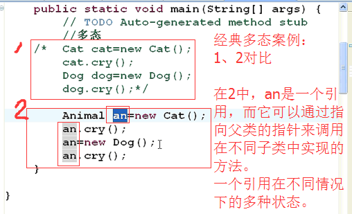

# 多态

所谓多态，就是指一个引用（类型）在不同的情况下的多种状态。也可以理解为，多态是指通过指向父类的指针，来调用在不同子类中实现的方法。

Java实现多态有三个必要条件：**继承、重写、向上转型**。

- 继承：在多态中必须存在有继承关系的子类和父类。

- 重写：子类对父类中某些方法进行重新定义，在调用这些方法时就会调用子类的方法。

- 向上转型：在多态中需要将子类的引用赋给父类对象，只有这样该引用才能够具备技能调用父类的方法和子类的方法。

只有满足了上述三个条件，才能够在同一个继承结构中使用统一的逻辑实现代码处理不同的对象，从而达到执行不同的行为。
